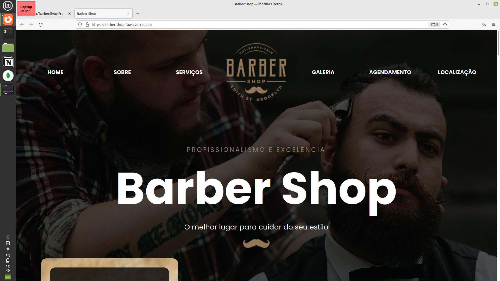
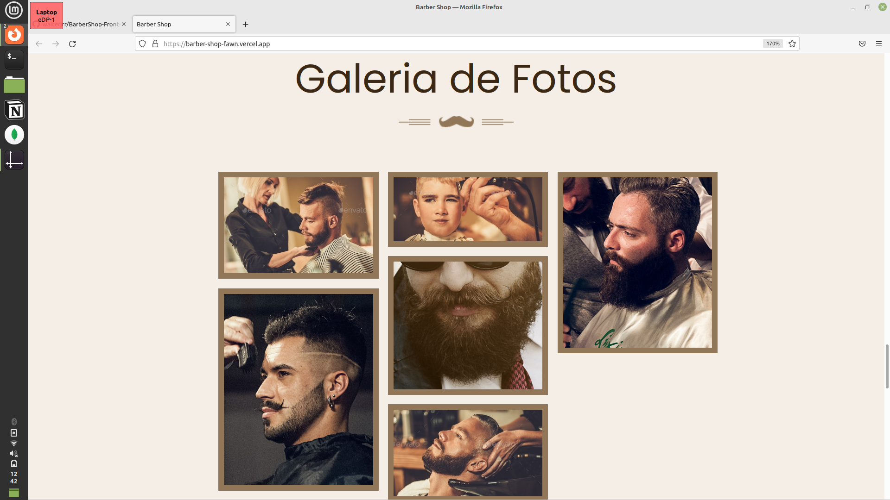
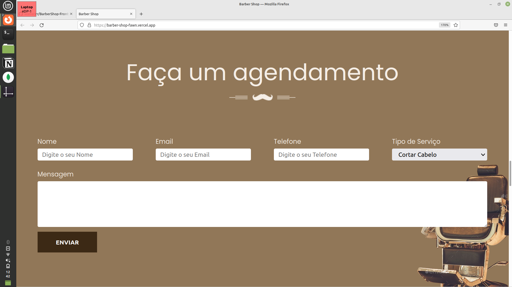
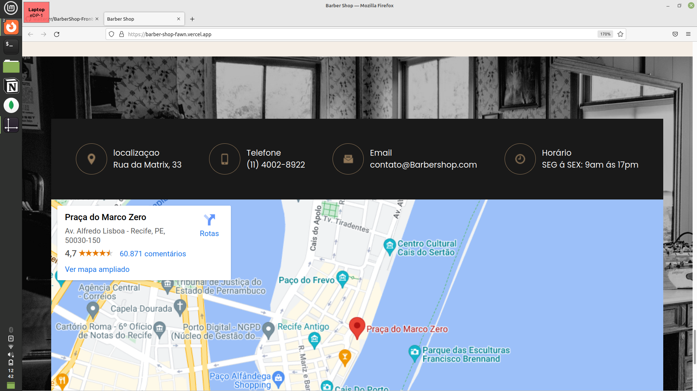

 
# Barber Shop

Uma página estática de uma Barbearia com integração para o email

Página completamente feita com HTML e CSS


## Acknowledgements

 - [Html semântico]
 - [Css]
 - [Form Submit](https://formsubmit.co/)


## Como ver o projeto

Faça um clone com do Repositório

```bash
  https://github.com/walterjrr/BarberShop-Front-End.git
  cd my-project
```
Use um Live server
## Link Do Site

http://barber-shop-fawn.vercel.app/
## Imagens 




</br>



